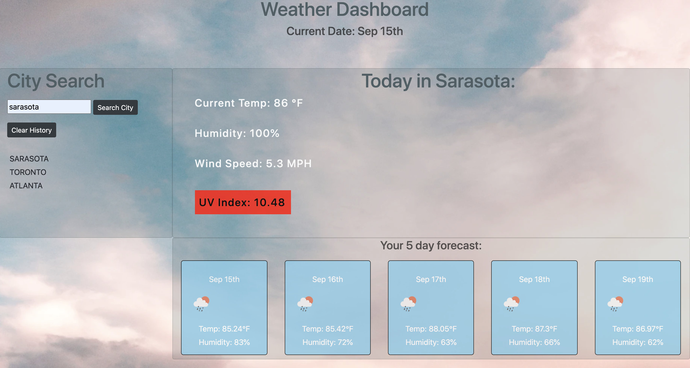
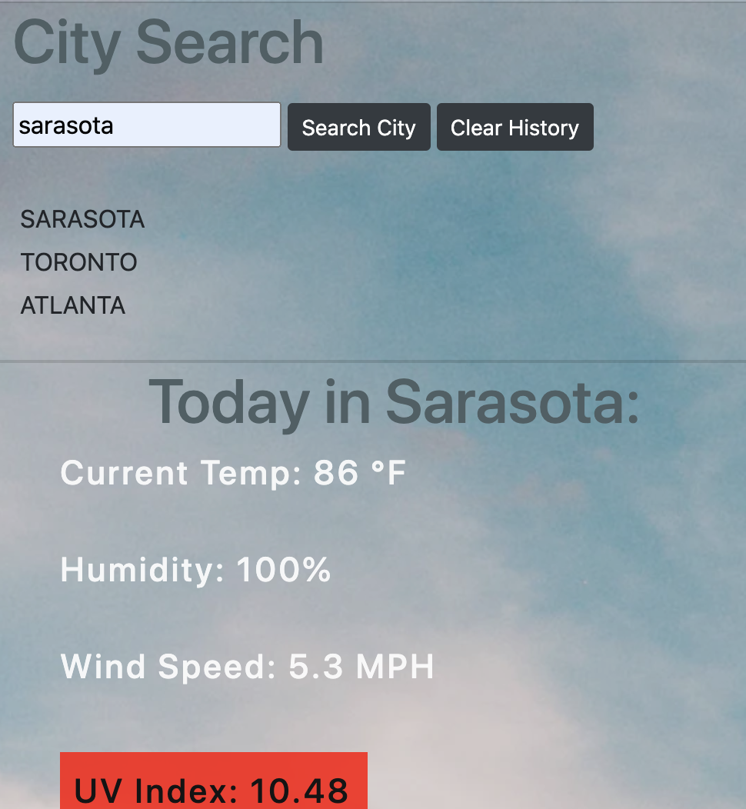

# weather-dashboard-app
This project combines the skills and techniques that we incorporated into our previous assignments in order to produce a functioning weather dashboard application. 

In order to successfully complete this project, we needed to employ skills that we've been honing in __local storage__, __ajax calls__, __3rd party API__ and __DOM manipulation__. 

This was a challenging and rewarding project that allowed us to explore all of the above in attempts to make something useful to its users. 

In order to successfully display weather data, we were required build API queries based on user-input and make a request to  a new API : [OpenWeather](https://openweathermap.org/api). 

Please find our User Story and Acceptance Criteria below.


## User Story

```
AS A traveler
I WANT to see the weather outlook for multiple cities
SO THAT I can plan a trip accordingly
```

## Acceptance Criteria

```
<!-- GIVEN a weather dashboard with form inputs
WHEN I search for a city
THEN I am presented with current and future conditions for that city and that city is added to the search history
WHEN I view current weather conditions for that city
THEN I am presented with the city name, the date, an icon representation of weather conditions, the temperature, the humidity, the wind speed, and the UV index
WHEN I view the UV index
THEN I am presented with a color that indicates whether the conditions are favorable, moderate, or severe
WHEN I view future weather conditions for that city
THEN I am presented with a 5-day forecast that displays the date, an icon representation of weather conditions, the temperature, and the humidity
WHEN I click on a city in the search history
THEN I am again presented with current and future conditions for that city
WHEN I open the weather dashboard
THEN I am presented with the last searched city forecast -->
```

## Images and Demo

#### Provided-Example


#### Home Screen Still


#### Mobile Still


#### Demo


## Credits

I completed this project with the collaboration of fellow classmates and following the critical review of my Georgia Tech Coding Boot Camp tutor. 

Additionally, I referenced the following:

#### OpenWeather
https://openweathermap.org/api

#### MomentJS
https://momentjs.com/

#### MDN
https://developer.mozilla.org/en-US/

### W3schools
https://www.w3schools.com/


## Links

#### Webpage
https://ad-fleming.github.io/weather-dashboard-app/

#### Repository
https://github.com/ad-fleming/weather-dashboard-app